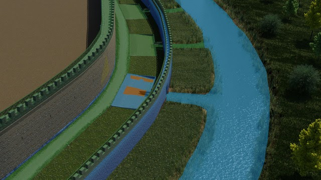
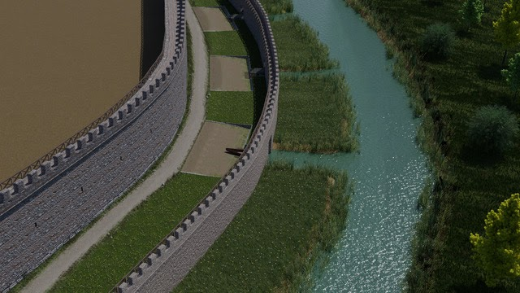
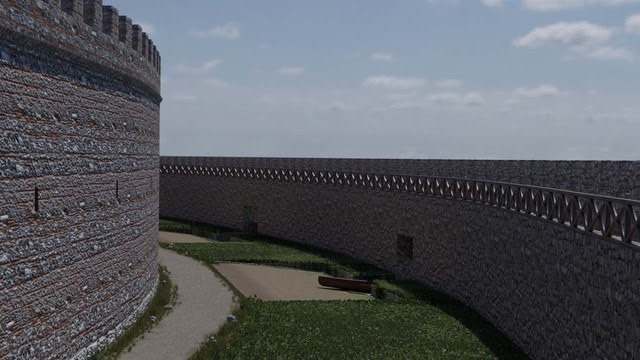
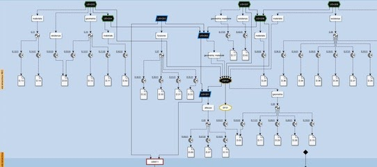
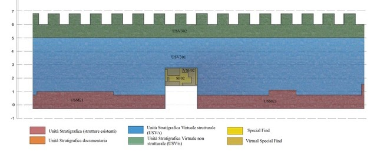
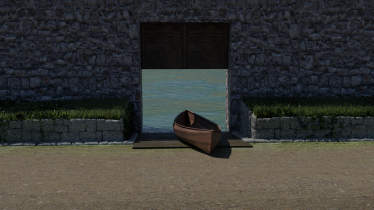

Since 2018, the **University of Verona** (prof. Patrizia Basso and prof. Diana Dobreva) has been carrying out fieldwork in the southern sector of Aquileia (Fondi ex Pasqualis), where the presence of two defensive walls — the so-called **"M2"** (3rd–4th century AD) and **"M3"** (5th century AD) — was already known.

In 2019 a collapsed portion of the external surface of the "M2" wall was discovered. This allowed a reconstruction of the elevation of the external wall, built on the bank of the Natissa river. During the 5th century AD a smaller defensive wall ("M3") was built ten metres towards the river, with entrances along the wall connecting the mercantile squares to the river itself.

The reconstructive proposals of the "M2" and "M3" defensive walls combine fieldwork data, historical and geological data, geophysics results, archaeological comparisons, literary sources, and iconographic sources.

*Proxy models of the reconstruction*

*Representation models of the Late Roman wall of Aquileia*

*View of the 3D reconstruction*

*One of the entrances located along the external wall*

## How EM was used

The Extended Matrix method was used for mapping, validating and representing the 3D reconstruction and the reconstructive process of the Late Roman defensive walls of Aquileia. Applying EM allowed the analysis of both the archaeological context and the connected sources to be improved, supporting a virtual reconstruction based on scientific data — transparent and easy to interact with.

*Extended Matrix*

*Orthographic view of the 3D reconstruction of the Late Roman wall*

## References

The 3D reconstruction of the Late Roman defensive walls of Aquileia was the subject of a thesis in *Quaternary, Prehistory and Archaeology* at the **University of Ferrara** (title: *Le mura tardoantiche di Aquileia: l'area dei Fondi Ex Pasqualis. Dallo studio alla ricostruzione*) by Nicola Del Barba, supervised by prof. Patrizia Basso (University of Verona) and Emanuel Demetrescu (DHILab, CNR-ISPC of Rome).
