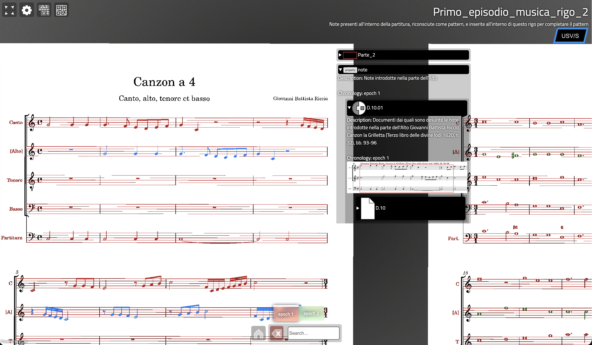

In this experiment EM has been applied to Musicology to map and represent reconstruction processes within the critical edition of two incomplete musical works:

1. Marc'Antonio Ingegneri's polyphonic hymn O Lux beata Trinitas (1606),  incorporating a liturgical melody
   - link to the [<u>Ingegneri's EMviq scene</u>](https://aton.ispc.cnr.it/a/emviq/?s=sberto/O-LUX_02) where visitors can explore the reconstruction process;
   - link to the [<u>Ingegneri's Hathor scene</u>](https://aton.ispc.cnr.it/s/sberto/O-LUX_02) where visitors have the possibility to listen to the audio track of the reconstructed hymn and that of the corresponding liturgical melody.
2. Giovanni Battista Riccio's Canzon a quattro (1614), which features quotations from music by Giovanni Gabrieli
   - link to the [<u>Riccio's EMviq scene</u>](https://aton.ispc.cnr.it/a/emviq/?s=sberto/EM_Canzon16) where visitors can explore the reconstruction process;
   - link to the [<u>Riccio's Hathor scene</u>](https://aton.ispc.cnr.it/s/sberto/EM_Canzon16) where visitors have the possibility to listen to an audio track of the reconstructed canzona.

*Ingegneri's case study (EMtools - Blender)*

*Riccio's case study (EMviq scene)*

## References

