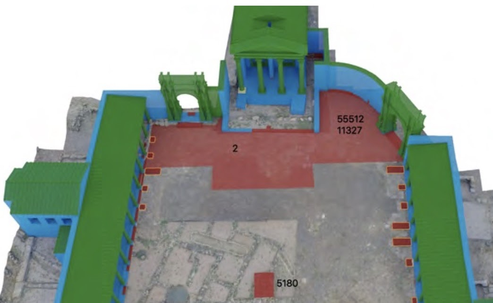
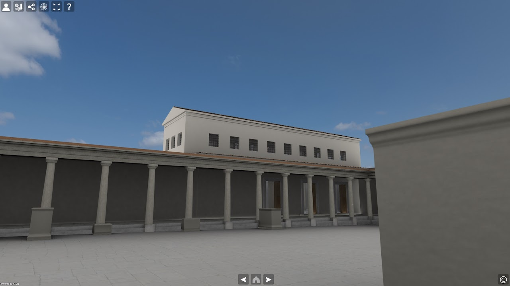

The archaeological site of Nora is located on the promontory of Capo di Pula, on the south coast of Sardinia, about 30 km south-west of Cagliari.

The forum occupies a level zone in the eastern sector of the Roman city and currently represents the largest open area discovered within the urban texture. The whole complex consists of a rectangular square (about 34 × 44 m) and several buildings built along three of the four sides of the square: a temple on the northern side, a basilica on the eastern side, and a Curia on the western side.

The area was discovered during the second half of the 20th century by Gennaro Pesce, and then intensively excavated from 1997 to 2006 by the **University of Padova**.

*Proxy model of the reconstruction*

## How EM was used

The Extended Matrix method was used to map, validate and represent the extensive and analytical reconstruction of two chronological phases of the complex (construction, 40–20 B.C.; renovation, 3rd century A.D.).

A 3D reconstruction of all the buildings facing the square — including their interiors — was realised. The entire 3D model was also superimposed on the 3D survey of the whole area, with the intent of visualising a transition between epochs (contemporary, construction and renovation).

The aim of the reconstruction was to create a 3D scene easy to understand and explore both for experts and non-experts. The forum of Nora was also published online with both **EMviq** and **Hathor**, the 3D web-apps included in the Extended Matrix Framework (EMF).

*Online sharing*

## References

Berto S., Demetrescu E., Fanini B., Bonetto J., Salemi G. (2021). *Analysis and Validation of the 3D Reconstructive Process through the Extended Matrix Framework of the Temple of the Roman Forum of Nora (Sardinia, CA)*. **Environmental Sciences Proceedings** 10, 1: 18. [DOI 10.3390/environsciproc2021010018](https://doi.org/10.3390/environsciproc2021010018).

Bonetto J., Falezza G., Ghiotto A.R., Novello M. (eds.) (2009). *Nora. Il foro romano. Storia di un'area urbana dall'età fenicia alla tarda antichità (1997–2006)*, I–IV. Scavi di Nora 1, Padova.
