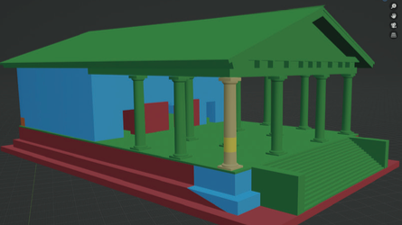
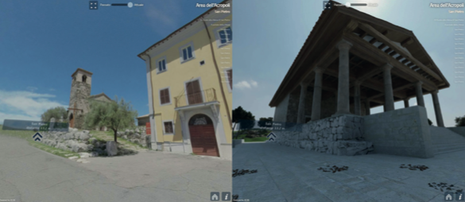
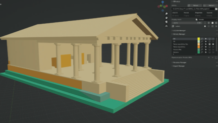
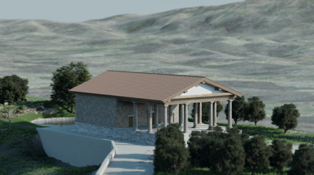
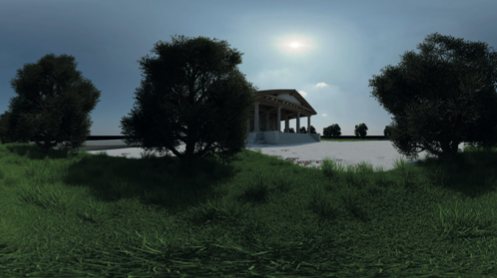

The **#SegniArcheologia** project aims to enhance the Cultural Heritage of Segni — a town within the territory of the Città metropolitana di Roma capitale — and to promote tourism in this particular area of the Regione Lazio.

Digital technologies, Cultural Heritage specialists and experts from different fields of research combined their knowledge to create an interactive guide of Segni. A web-app for smartphone and tablet was realised to store all the information regarding Segni and to establish a connection with the local museum.

*Proxy models of the reconstruction*

*Online sharing*

## How EM was used

Within the project, EM was used to guide the reconstructive process of the **Late-Republican temple** built on the acropolis of the city, tracking sources and the reasoning behind every interpretive decision.

*Representation of the chronological periods*

*View of the final representation model (aerial point of view)*

*View of the final representation model (terrestrial point of view)*

## References

Project web page: [segniarcheologia.it](https://segniarcheologia.it)

Zenodo community: [#segniarcheologia](https://zenodo.org/communities/segniarcheologia/)
