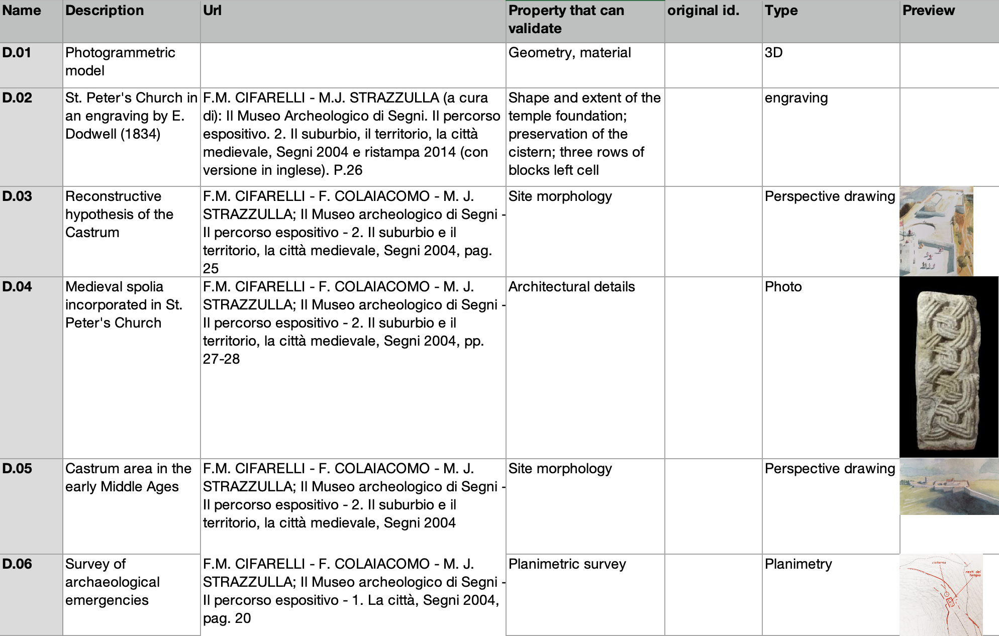

## What it is

`source_list.xlsx` is the canonical XLSX template for the
**bibliographic and archival source registry** of an Extended Matrix
project. It sits at the project root, next to the `.graphml`, and acts
as the single point of truth for every source the graph cites.

Each row is one source — a publication, an archival document, a
photograph, an analysis report, a 3D survey. Each source receives a
project-local identifier (`D.01`, `D.02`, …) that:

- **the GraphML's `Document` nodes reference** as their stable id,
- **the `DosCo` folder uses as filename prefix**
  (`D.02_excavation_report_1979.pdf`),
- **EMtools and Heriverse pick up at import time** to populate the
  rich metadata of every Document node downstream.

This three-way binding — graph ↔ spreadsheet ↔ DosCo files — is what
lets you maintain a project's bibliography in one place and have it
flow into every downstream view (yEd, Blender, the web).

## What the schema looks like

The 1.5 stable schema is a single sheet with eight columns:
`Name`, `Description`, `Url`, `Property that can validate`,
`original id.`, `Type`, `Preview`, `Notes`. Open the empty template
and hover the column headers for per-column help.

Full column reference and worked example: see
[the EM manual — Source List schema](https://docs.extendedmatrix.org/en/latest/source_node.html#source-list-schema).

## When to use it

- You are starting a new EM project and want to capture the
  bibliography upfront, before any nodes are drawn.
- You are migrating a legacy project's sources into EM and need a
  consistent registry.
- You want every paradata chain in the graph to terminate on a
  citeable record with a stable id and metadata.

## Compatibility

| EM version | Status |
|---|---|
| 1.3 | Original target — formalised as the *source list for data collection* |
| 1.4 | Fully valid — keep using this template |
| 1.5 | **Fully valid** — the single-sheet 8-column schema is the supported one |
| 1.6 | Revised schema in preparation: two-sheet split (Analytical / Comparative) + closed `Type` vocabulary aligned with the DocumentNode three-axis classification — tracked as [DP-58](https://docs.extendedmatrix.org/projects/development-projects/) |

## Get the template

Use the **Download latest** button at the top of this page — it
fetches `sources_list v.1.3.2.xlsx` directly from the
[ExtendedMatrix repository](https://github.com/zalmoxes-laran/ExtendedMatrix/tree/main/03_Sources_list).
The legacy filename is kept stable so download links across all the
version-tagged docs and external references keep working: the same
1.3 template is the supported artefact for EM 1.3, 1.4 and 1.5 — the
schema simply did not change across those releases. When EM 1.6 ships
its revised two-sheet schema, a separate file with a cleaner naming
convention will appear alongside (see
[DP-58](https://docs.extendedmatrix.org/projects/development-projects/)).

The file is shipped as a **populated template**: 972 real entries from
the Castrum di Segni / St. Peter's Church project, kept in place so
you can reverse-engineer the column conventions by reading actual
archaeological practice rather than abstract column descriptions.
A `README` sheet at the front explains how to use it for your own
project — the short version is *delete all data rows below the header,
reset the IDs from `D.01`, and start populating with your own
sources*. Per-column help comments are attached to the header cells
of the `sources` sheet.

## How EMtools picks it up

In Blender, EMtools imports `source_list.xlsx` alongside the GraphML
and the DosCo folder. The Document nodes in the scene's stratigraphic
graph receive their full metadata from the matching row in the
spreadsheet — so the same `D.02` identifier you typed in yEd is now,
inside Blender, a Document node carrying its title, citation,
"properties it can validate" list, and the DosCo file it points at.

The didactic story is: **before** the import, Document nodes show only
their `D.NN` identifiers; **after** the import, they carry the full
descriptive content from the spreadsheet — without any change to the
GraphML itself.

<!--
EDITOR: capture two screenshots from a real project (e.g. Basilica
Iulia or Great Temple) of the *Document Manager* panel in Blender:

  1) BEFORE — Document nodes with id D.01, D.02, … and empty
     descriptions / URLs (just IDs and empty fields).
  2) AFTER — same Document nodes after running the source_list import,
     now showing rich descriptions, URLs and validation properties
     from the spreadsheet.

Save them as
  src/assets/tools/source-list-emtools-before.png
  src/assets/tools/source-list-emtools-after.png
and uncomment the figure block below.
-->

<!--

-->

## How Heriverse exposes it

When the project is published to Heriverse, the Document metadata you
captured in `source_list.xlsx` becomes the content of the **paradata
pop-ups** that visitors see when they click on a reconstructed unit:
the source citation, the validation chain, the link back to the
archival reference. The same registry that drives Blender's Document
Manager drives the public web scene — no manual re-typing.

<!--
EDITOR: add a screenshot of a Heriverse scene with a paradata pop-up
open on a Document node, showing the metadata pulled from the source
list. A side-by-side with the spreadsheet row would make the binding
obvious — but a single Heriverse pop-up screenshot is also fine.

Save it as
  src/assets/tools/source-list-heriverse-popup.png
and uncomment the figure block below.
-->

<!--

-->

## Manual & roadmap

- [Source List schema (EM 1.5 manual)](https://docs.extendedmatrix.org/en/latest/source_node.html#source-list-schema)
  — column reference and worked example.
- [DP-58 — Bibliographic & Archival Sources Template](https://docs.extendedmatrix.org/projects/development-projects/)
  — design status of the 1.6 revision (two-sheet split, closed Type
  vocabulary, integration into `em_data.xlsx`).
